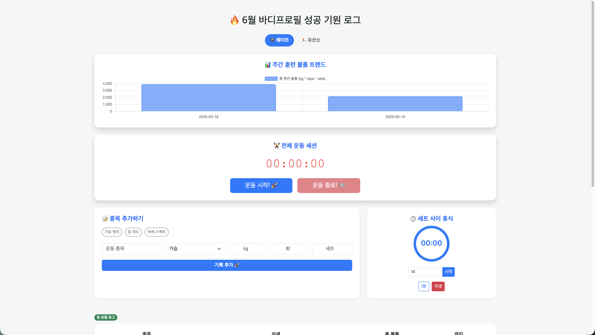

# 🏋️‍♂️ gym-tracker (오운완 기록 및 관리 서비스)

> **"작년의 실패를 딛고, 2026년 AWS 클라우드 배포 성공! 이제 24시간 멈추지 않는 헬스장입니다."** 

6월 바디프로필 성공을 목표로 개발된 개인별 맞춤형 운동 관리 애플리케이션입니다. [cite: 2026-01-29] 
현재 **AWS EC2** 환경에서 정식 운영 중이며, 실시간 데이터 동기화와 개인화된 대시보드를 제공합니다. 

---

## 📂 프로젝트 핵심 기능 (Updated)
* **🌐 24/7 클라우드 서비스:** AWS EC2 인스턴스를 통해 장소에 상관없이 접속 가능하며, 80번 포트(HTTP) 설정을 통해 사용자 접근성을 극대화했습니다. 
* **⚙️ 자동화된 배포 시스템:** `deploy.sh` 쉘 스크립트를 구축하여 서버 중지, 환경 변수 주입, 백그라운드 실행(nohup)을 단 한 번의 명령어로 처리합니다. 
* **🔐 이메일 인증 및 보안:** Spring Security와 SMTP를 결합한 이메일 인증 시스템으로 실사용자 검증 로직을 강화했습니다.
* **📊 실시간 데이터 분석:** Chart.js를 활용하여 주간 총 훈련 볼륨과 부위별 운동 비중을 시각적으로 분석합니다.
* **☁️ 데이터 무결성:** TiDB Cloud(AWS Tokyo)와의 연동을 통해 클라우드 환경에서도 안정적인 데이터 관리가 가능합니다. 

---

## 🛠️ 기술 스택 (Tech Stack)

### **Infrastructure & DevOps**
* **Cloud:** AWS EC2 (Ubuntu 24.04 LTS) 
* **Web Server:** Embedded Apache Tomcat (Port: 80) 
* **CI/CD:** Bash Scripting (`deploy.sh`)를 통한 무중단 수동 배포 자동화 
* **Environment:** Linux Environment Variables (`export`) 관리 

### **Backend**
* **Language/Framework:** Java 21, Spring Boot 3.x 
* **Persistence:** Spring Data JPA, Hibernate 7.x 
* **Security:** Spring Security (BCrypt, Role-based Access Control)

### **Frontend**
* **Engine/UI:** Thymeleaf, Bootstrap 5.3.0, Glassmorphism CSS 
* **Visualization:** Chart.js 4.x

### **Database**
* **RDBMS:** TiDB Cloud (MySQL Compatible, AWS Tokyo Region) 

---

## 💡 개발 로그 (Major Update Highlights)

### **2026.03.21 - AWS Cloud Deployment & Automation** 
* **[Challenge]** 1년 전 실패했던 AWS EC2 배포에 재도전하여 성공했습니다. 
* **[Infra]** `server.port: 80` 설정을 통해 사용자 주소창에서 포트 번호를 생략하여 접근성을 개선했습니다. 
* **[Script]** 환경 변수 유실 방지를 위해 `sudo -E` 옵션을 활용한 통합 배포 스크립트(`deploy.sh`)를 제작하였습니다. 
* **[Troubleshooting]** YAML 중복 키 에러 및 Linux 권한 거부 문제를 해결하며 서버 운영 능력을 키웠습니다. 

### **2026.02.19 - TiDB Cloud Migration & MacBook M4 Dev Environment** 
* 로컬 DB에서 TiDB Cloud로 마이그레이션하여 데이터 접근성을 확보했습니다. 
* MacBook Air M4 환경에서의 고성능 빌드 환경을 구축하였습니다. 

## 🖥️ 화면 미리보기 (ScreenShot)

